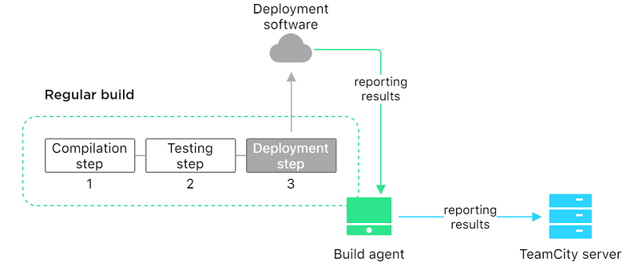
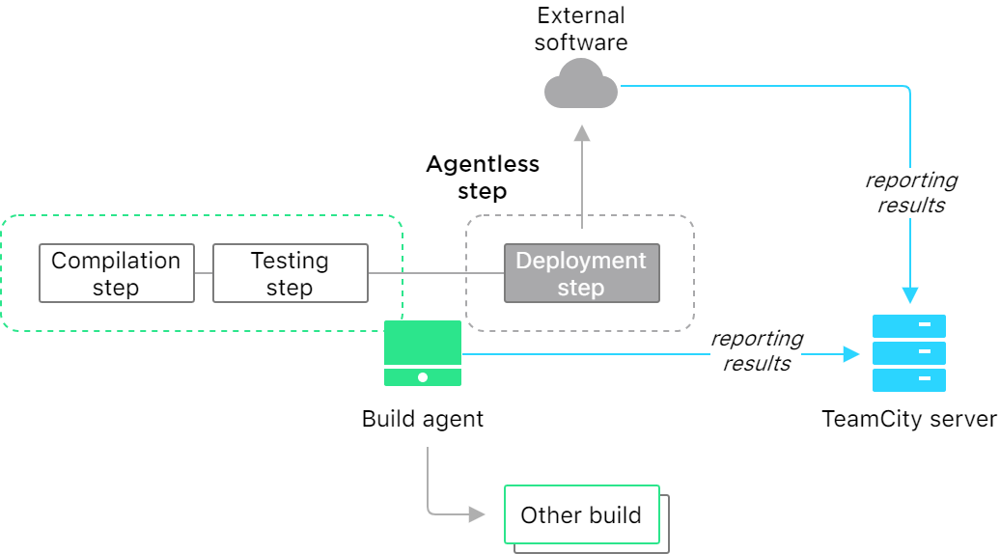

[//]: # (title: Agentless Build)
[//]: # (auxiliary-id: Agentless Build)

>This functionality is introduced in terms of TeamCity 2020.2 Early Access Program.

_Agentless builds_ are builds that can run virtually, without an [agent](build-agent.md).

A build agent is usually required to run a build from start to finish. However, if a running build does not need its agent for some remaining operations, it can send an instruction to "release" the agent. This agent becomes available and can be instantly assigned to another build.

This approach allows saving agents' work time and is optimal for configurations that use third-party tools for finalizing a build: for example, to deploy a project. Such a build can finish outside of TeamCity, and the TeamCity server will detect its status reports directly, without using an agent as a mediator.

Let's compare a regular build that consists of three steps: compilation, testing, and deployment. All of them are processed by an agent even though the deployment step is actually performed by the external software. The agent is reporting results to the TeamCity server and stays assigned to the build until it is finished.

With the agentless approach, the agent does not need to handle the final deployment step and can run other builds from the queue. The TeamCity server will catch the reports directly from the external tool.

<seealso>
        <category ref="admin-guide">
            <a href="managing-agentless-builds.md">Managing Agentless Builds</a>
        </category>
</seealso>